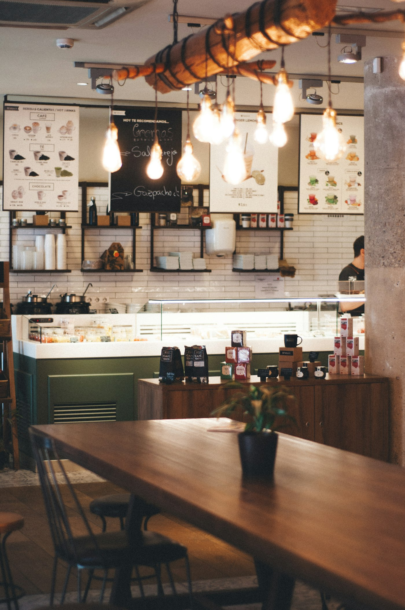

#  Brew Haven - Coffee Shop Landing Page

[🔗 Live Demo](https://alaaahmed1343-coder.github.io/brew-haven-landing-page/)

A modern, responsive, and elegant landing page for a specialty coffee shop built with **HTML5**, **CSS3**, and **Bootstrap 5**.



##  Features

- **Responsive Design:** Fully optimized for desktops, tablets, and mobile screens.
- **Hero Section:** High-impact background with call-to-action buttons.
- **Story Section:** Clean layout highlighting brand history and features.
- **Interactive Menu:** Categorized coffee offerings with custom typography.
- **Contact & Location:** Styled cards for business hours, location, and contact information.
- **Clean Utility-Based Code:** Refactored to leverage Bootstrap 5 utility classes for maintainability and performance.

##  Built With

* **HTML5** - Semantic markup.
* **CSS3** - Custom styling, CSS variables, and Google Fonts integration.
* **Bootstrap 5** - Responsive grid system, Flexbox utilities, and components.
* **Font Awesome 6** - Vector icons for visual enhancements.

## Getting Started

To view or use this project locally:

1. **Clone the repository:**
   ```bash
   git clone [https://github.com/alaaahmed1343-coder/brew-haven-landing-page.git](https://github.com/alaaahmed1343-coder/brew-haven-landing-page.git)
